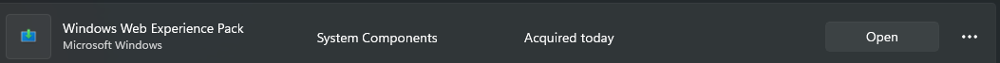

перевстановити віджети Windows 11

На цьому скріншоті видно, що один з віджетів Windows 11 (імовірно “News” або “Weather”) зависає на завантаженні (синій кружечок на чорному фоні). Це поширена проблема у Windows 11, особливо після оновлень. Ось як її можна вирішити:

🔧 Кроки для вирішення проблеми:
✅ 1. Перезапуск процесу “Widgets”
Відкрий Task Manager (Ctrl + Shift + Esc).

Знайди процес Windows Widgets (або Widgets.exe).

Клікни правою кнопкою —> End Task.

Після завершення натисни Win + W (щоб знову відкрити віджети).

✅ 2. Перезапуск Windows Web Experience Pack
Відкрий PowerShell від імені адміністратора.

Виконай:

powershell
Копіювати
Редагувати
Get-AppxPackage MicrosoftWindows.Client.WebExperience | Restart-Service
Якщо помилка — спробуй переінсталювати пакет нижче.

🧼 3. Перевстановлення Windows Widgets:
В PowerShell (від адміна):

powershell
Копіювати
Редагувати
Get-AppxPackage MicrosoftWindows.Client.WebExperience | Remove-AppxPackage
Потім перевстанови з Microsoft Store:

Перейди: Web Experience Pack – Microsoft Store

🧰 4. Додаткові дії, якщо нічого не допомогло:
Очисти кеш віджетів:

powershell
Копіювати
Редагувати
Remove-Item -Path "$env:LOCALAPPDATA\Packages\MicrosoftWindows.Client.WebExperience_cw5n1h2txyewy\LocalState" -Recurse -Force
Перезавантаж ПК.

Перевір системні оновлення: Settings → Windows Update → Check for updates

Хочеш, я згенерую автоматизований .bat або PowerShell-скрипт, який усе це зробить?

Ви сказали:

Програма ChatGPT сказала:
Добре, ти вже на правильному шляху — "Windows Web Experience Pack" саме відповідає за роботу віджетів у Windows 11. Якщо на цьому етапі все зависає на "Preparing to download / Getting files ready", спробуй наступне:

✅ 1. Перезапусти Windows Store Installer
Іноді Microsoft Store зависає при підготовці. Виконай:

powershell
Копіювати
Редагувати
Get-AppxPackage Microsoft.WindowsStore | Foreach {Add-AppxPackage -DisableDevelopmentMode -Register "$($_.InstallLocation)\AppXManifest.xml"}
Після цього перезапусти ПК і знову спробуй встановити Web Experience Pack.

✅ 2. Очисти кеш Microsoft Store:
Натисни Win + R.

Введи:

Копіювати
Редагувати
wsreset.exe
Дочекайся, поки відкриється Microsoft Store — кеш буде очищено.

✅ 3. Спробуй встановити через PowerShell напряму:
powershell
Копіювати
Редагувати
winget install 9MSSGKG348SP --source msstore
Це викличе встановлення пакета напряму через Microsoft Store CLI.

✅ 4. Тимчасовий обхід:
Поки пакет не встановиться, ти можеш вимкнути віджети:

Перейди в Settings → Personalization → Taskbar.

Вимкни перемикач Widgets.

Це прибере завислий віджет із панелі, щоб не заважав.

🔁 Після успішної установки Web Experience Pack:

Перезавантаж комп’ютер.

Увімкни віджети назад.

Натисни Win + W, щоб перевірити, чи все працює.

🔧 Хочеш, згенерую .bat або .ps1 файл, який зробить усе це автоматично?

Ви сказали:
Remove-Item -Path "$env:LOCALAPPDATA\Packages\MicrosoftWindows.Client.WebExperience_cw5n1h2txyewy\LocalState" -Recurse -Force
Remove-Item: Cannot find path 'C:\Users\StepanV\AppData\Local\Packages\MicrosoftWindows.Client.WebExperience_cw5n1h2txyewy\LocalState' because it does not exist.
PS D:\temp> Get-AppxPackage Microsoft.WindowsStore | Foreach {Add-AppxPackage -DisableDevelopmentMode -Register "$($_.InstallLocation)\AppXManifest.xml"}
Add-AppxPackage: Deployment failed with HRESULT: 0x80073D02, The package could not be installed because resources it modifies are currently in use.

error 0x80073D02: Unable to install because the following apps need to be closed Microsoft.WindowsStore_22504.1401.19.0_x64__8wekyb3d8bbwe.

NOTE: For additional information, look for [ActivityId] 0264f6bb-e022-0006-76af-710222e0db01 in the Event Log or use the command line Get-AppPackageLog -ActivityID 0264f6bb-e022-0006-76af-710222e0db01

Програма ChatGPT сказала:
Дуже добре, ти вже близький до розв’язання. Давай розберемося з кожною помилкою:

🧼 1. Помилка Remove-Item:
Cannot find path [...] because it does not exist.

✅ Це не проблема, просто значить, що віджет ще жодного разу не створив локальні файли — тобто ця папка ще не існує. Можна пропустити цей крок.

🔧 2. Помилка Add-AppxPackage:
0x80073D02: Unable to install because the following apps need to be closed [...] Microsoft.WindowsStore

Це значить, що Microsoft Store був відкритий під час перереєстрації, тому його потрібно завершити вручну перед повторною командою.

🔁 Виправлення:
Закрий повністю Microsoft Store (натисни правою кнопкою по значку → Close window).

Потім у PowerShell (від імені адміністратора) запусти ще раз:

powershell
Копіювати
Редагувати
Get-AppxPackage Microsoft.WindowsStore | Foreach {
    Add-AppxPackage -DisableDevelopmentMode -Register "$($_.InstallLocation)\AppXManifest.xml"
}
🛠 Рекомендований порядок дій (підсумок):
Закрий Microsoft Store.

Очисти кеш Store:

Копіювати
Редагувати
wsreset.exe
Перереєструй Store:

powershell
Копіювати
Редагувати
Get-AppxPackage Microsoft.WindowsStore | Foreach {
    Add-AppxPackage -DisableDevelopmentMode -Register "$($_.InstallLocation)\AppXManifest.xml"
}
Перезавантаж комп'ютер.

Відкрий Microsoft Store знову і встанови Web Experience Pack.

📦 Хочеш — згенерую PowerShell-скрипт, який зробить усе це автоматично (крім ручного закриття Store)?

Ви сказали:

install wingets

Програма ChatGPT сказала:
На твоєму скріншоті відкриті налаштування панелі задач, але Winget (Windows Package Manager) встановлюється окремо через PowerShell або Store — його не знайти тут.

✅ Як перевірити, чи встановлений winget:
Відкрий PowerShell і введи:

powershell
Копіювати
Редагувати
winget --version
Якщо бачиш версію (наприклад, v1.6.3482), значить все ок.

Якщо отримуєш помилку типу winget: command not found, тоді переходимо до встановлення.

🛠 Як встановити winget (якщо не встановлений):
🔹 Спосіб 1: Через Microsoft Store
Перейди за цим посиланням:
👉 App Installer – Microsoft Store

Встанови або онови "App Installer" — саме він додає підтримку winget.

🔹 Спосіб 2: Через PowerShell (якщо Store не працює)
Завантаж .msixbundle звідси:
👉 https://github.com/microsoft/winget-cli/releases/latest

Установи вручну:

powershell
Копіювати
Редагувати
Add-AppxPackage -Path "C:\шлях\до\AppInstallerFile.msixbundle"
(заміни шлях на свій)

🔁 Після встановлення перезавантаж ПК і знову перевір winget --version.