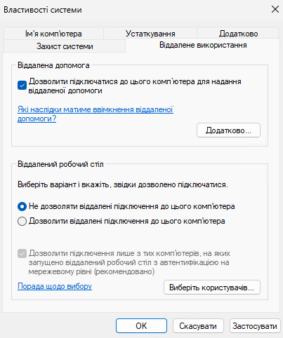
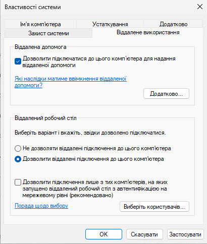

# Щоб дозволити RDP (Remote Desktop Protocol) у PowerShell на Windows, виконай ці команди від імені адміністратора:


### ✅ 1. Увімкнути RDP-службу
```powershell
Set-ItemProperty -Path 'HKLM:\System\CurrentControlSet\Control\Terminal Server' -Name "fDenyTSConnections" -Value 0
```

### ✅ 2. Дозволити RDP через брандмауер Windows
```powershell
Enable-NetFirewallRule -DisplayGroup "Remote Desktop"
```

### ✅ 3. Перевірити, чи дозволено
```powershell
(Get-ItemProperty -Path 'HKLM:\System\CurrentControlSet\Control\Terminal Server').fDenyTSConnections
```

Має бути 0 — означає, що RDP увімкнено.

## 🔒 (Необов’язково) Дозволити лише для певного інтерфейсу або IP. Для підвищення безпеки можна обмежити доступ.

🧠 Додатково:
RDP працює на TCP-порті 3389

Якщо комп’ютер у публічній мережі, RDP може блокуватись

Користувач, до якого ти підключаєшся, має бути у групі Remote Desktop Users або бути адміністратором

## 🛠️ Додати користувача до групи RDP для доступу через віддалений робочий стіл:
```powershell
Add-LocalGroupMember -Group "Remote Desktop Users" -Member "YourUsername"
```


### "Дозволити підключення лише з тих комп’ютерів, на яких запущено віддалений робочий стіл з автентифікацією на мережевому рівні (NLA)"

Якщо хочеш зняти її, тобто вимкнути обов’язкову мережеву автентифікацію (NLA) — зроби це через PowerShell:

✅ Команда PowerShell:
```powershell
Set-ItemProperty -Path 'HKLM:\SYSTEM\CurrentControlSet\Control\Terminal Server\WinStations\RDP-Tcp' -Name "UserAuthentication" -Value 0
```

🔄 Перезапусти службу RDP (опційно):
```powershell
Restart-Service TermService -Force
```

## ⚠️ Після цього з’єднання може коротко перерватися!

Це очікувана поведінка і не є помилкою. Переривання відбувається через перезапуск служби RDP і зазвичай триває лише кілька секунд.
Це відбувається через перезапуск служби RDP і зазвичай триває лише кілька секунд.

## 🧠 Що це дає?
Без NLA можна підключатися зі старіших клієнтів або з Linux/Mac без специфічної підтримки NLA.

Це менш безпечно, але часто потрібно для тестів або Ansible/WinRM.

